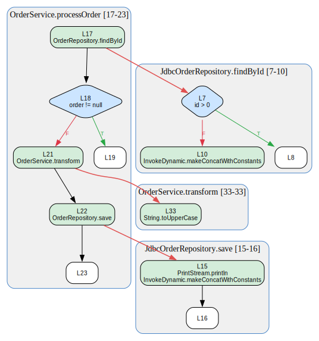

# Java Bytecode Tools

[](https://github.com/avishek-sen-gupta/java-bytecode-tools/actions/workflows/ci.yml)
[](LICENSE.md)

Interprocedural call tracing and control-flow graph construction from Java source and bytecode. Given any code path you want to understand — "what happens when this method fires?" or "what calls this DAO method?" — these tools build structural call graphs and CFGs from compiled `.class` files and let you trace through them in both directions, producing JSON trees and SVG visualizations.

The repository combines:

- A Java CLI built on SootUp for call-graph construction and interprocedural tracing
- A small Python toolchain for method-level call-graph views, trace slicing, ref expansion, semantic graph building, validation, and DOT/SVG rendering
- A fixture project plus end-to-end tests that exercise the full pipeline

**Forward trace of `OrderService.processOrder`** — branches, calls to repository and internal methods, resolved down to source lines:

<p align="center">
  
</p>

Key Java commands:

- `buildcg`: build caller → callee edges for project classes
- `dump`: list methods in a class with source line ranges
- `xtrace`: forward interprocedural trace from an entry point

Key Python commands:

- `fw-calltree`: walk call-graph JSON and emit a flat `{nodes, calls, metadata}` call graph reachable from a named method (methods only, no CFG)
- `calltree-print`: render `fw-calltree` output as an ASCII call tree
- `calltree-to-dot`: render `fw-calltree` output as a DOT/SVG call-tree diagram
- `rev-calltree`: backward interprocedural trace to a target method; emits flat `{nodes, calls, metadata}` graph
- `frames-print`: pretty-print backward trace chains
- `ftrace-inter-slice`: extract a subtree or path-constrained slice from `xtrace` output
- `ftrace-intra-slice`: slice a single method's CFG to the blocks on the path between two source lines
- `ftrace-expand-refs`: replace `ref` leaves with full method bodies
- `ftrace-semantic`: normalize raw `xtrace` JSON into a semantic graph (CFG-level)
- `ftrace-semantic-to-dot`: render semantic graph JSON as DOT/SVG
- `ftrace-validate`: validate semantic graph output
- `jspmap`: map JSP EL actions through a call graph; emits flat {nodes, calls, metadata} consumable by calltree-print, frames-print, calltree-to-dot

## Tool Combinations

There are three main output families in this repo:

- `buildcg` produces the shared call-graph JSON that feeds method-level tools
- `xtrace` produces a CFG-rich trace envelope that feeds the trace/semantic pipeline
- `fw-calltree`, `rev-calltree`, and `jspmap` all converge on the same flat `{nodes, calls, metadata}` schema for printing and rendering

```mermaid
flowchart LR
    classDef artifact fill:#f6f8fa,stroke:#6b7280,color:#111827
    classDef entry fill:#e0f2fe,stroke:#0369a1,color:#0f172a
    classDef view fill:#ecfccb,stroke:#4d7c0f,color:#1f2937

    cp[classpath]:::artifact
    jsp[JSP files<br/>faces-config]:::artifact

    subgraph java["Java entry points"]
        dump[dump]:::entry
        buildcg[buildcg]:::entry
        xtrace[xtrace]:::entry
    end

    ranges[method ranges JSON]:::artifact
    cg[call graph JSON]:::artifact
    trace[trace envelope JSON<br/>{trace, refIndex}]:::artifact
    flat[flat graph JSON<br/>{nodes, calls, metadata}]:::artifact
    semantic[semantic graph JSON]:::artifact

    fw[fw-calltree]:::entry
    rev[rev-calltree]:::entry
    jspmap[jspmap]:::entry

    inter[ftrace-inter-slice]:::entry
    intra[ftrace-intra-slice]:::entry
    expand[ftrace-expand-refs]:::entry
    sem[ftrace-semantic]:::entry

    cpview[calltree-print]:::view
    fpview[frames-print]:::view
    dotview[calltree-to-dot]:::view
    semdot[ftrace-semantic-to-dot]:::view
    validate[ftrace-validate]:::view

    cp --> dump
    cp --> buildcg
    cp --> xtrace

    dump --> ranges
    buildcg --> cg
    cg --> xtrace
    cg --> fw
    cg --> rev
    cg --> jspmap
    jsp --> jspmap

    xtrace --> trace
    trace --> inter
    trace --> intra
    inter --> expand
    intra --> expand
    expand --> sem
    sem --> semantic
    semantic --> semdot
    semantic --> validate

    fw --> flat
    rev --> flat
    jspmap --> flat
    flat --> cpview
    flat --> fpview
    flat --> dotview
```

## Setup

```bash
./build.sh
```

Requirements checked by the build script:

- Java 21+
- Maven
- Python 3.13+
- `uv`
- `jq` for the end-to-end test suite

`build.sh` compiles the Java project, copies Maven runtime dependencies into `java/target/dependency/`, and creates the Python environment in `python/.venv`.

### Pre-Commit Hooks

```bash
pre-commit install
```

Hooks run automatically on commit:

- [Black](https://github.com/psf/black) — Python formatting
- [google-java-format](https://github.com/google/google-java-format) — Java formatting
- [Talisman](https://github.com/thoughtworks/talisman) — secret detection
- [Pyright](https://github.com/microsoft/pyright) — Python type checking
- [pip-audit](https://github.com/pypa/pip-audit) — Python dependency vulnerability scanning
- E2E test suite

## Command Shape

All bytecode commands go through `scripts/bytecode.sh`:

```bash
scripts/bytecode.sh [--prefix <package-prefix>] <classpath> <subcommand> [options]
```

Notes:

- `--prefix` limits analysis to classes whose fully qualified name starts with the given prefix. Without it, every class visible on the classpath is analyzed.
- `<classpath>` is a colon-separated classpath of compiled classes and jars
- Java JSON-producing commands write to stdout by default; use `--output <file>` to write a file instead
- Python tools that accept `--input` also read from stdin when `--input` is omitted
- Python tools that accept `--output` write to stdout when `--output` is omitted

Example shape:

```bash
scripts/bytecode.sh --prefix com.example. /path/to/classes buildcg --output callgraph.json
```

## Quick Start

The repository ships a small fixture application under `test-fixtures/src/com/example/app`. To generate fixture classes manually:

```bash
mkdir -p test-fixtures/classes
javac -g -d test-fixtures/classes test-fixtures/src/com/example/app/*.java
```

Then use:

```bash
CP=test-fixtures/classes
```

### 1. Build The Call Graph

Scans all project classes matching the prefix, extracts invoke statements, and records caller-to-callee edges. Resolves polymorphic dispatch by mapping interfaces to concrete implementations.

```bash
scripts/bytecode.sh --prefix com.example. "$CP" \
  buildcg --output callgraph.json
```

The result is a JSON object with two keys:

```json
{
  "callees": {
    "<com.example.app.OrderController: void handleGet()>": [
      "<com.example.app.OrderService: void processOrder()>"
    ]
  },
  "callsites": {
    "<com.example.app.OrderController: void handleGet()>": {
      "<com.example.app.OrderService: void processOrder()>": 42
    }
  }
}
```

`callees` maps each caller to the list of methods it calls. `callsites` maps each caller to a `{callee: line}` map recording the source line where each call is made.

### 2. Find A Method And Its Source Lines

Use `dump` to resolve a class to method ranges:

```bash
scripts/bytecode.sh --prefix com.example. "$CP" \
  dump com.example.app.OrderService --output order-service.json
```

The output includes each method's `lineStart` and `lineEnd`. Those line numbers are how `xtrace` and `rev-calltree` identify entry and target methods.

### 3. Forward Trace From An Entry Point

Identify the entry method by source line or by method name:

```bash
# By line number (use `dump` to find the line)
scripts/bytecode.sh --prefix com.example. "$CP" \
  xtrace --call-graph callgraph.json \
  --from com.example.app.OrderService --from-line 17 \
  --output forward.json

# By method name (simpler when the name is unambiguous)
scripts/bytecode.sh --prefix com.example. "$CP" \
  xtrace --call-graph callgraph.json \
  --from com.example.app.OrderService --from-method processOrder \
  --output forward.json
```

`--from-line` and `--from-method` are mutually exclusive; exactly one is required. If the method name is overloaded, the error message lists all overloads with their line numbers so you can switch to `--from-line` to disambiguate.

`xtrace` is implemented as a two-pass pipeline:

1. **Discover** — DFS over the call graph from the entry point, classifying each reachable method as normal, cycle, or filtered
2. **Build** — construct CFG-rich method bodies for the root; emit all other methods as lightweight `ref` nodes with their full bodies in a flat `refIndex`

The output is an envelope:

```json
{
  "trace": {
    "class": "com.example.app.OrderService",
    "method": "processOrder",
    "blocks": [],
    "edges": [],
    "traps": [],
    "children": []
  },
  "refIndex": {}
}
```

Important details:

- The root method body is stored under `trace`
- Non-root normal callees are emitted as lightweight `ref` nodes in `children`
- Full bodies for those `ref` nodes live in `refIndex`
- Recursive edges become `cycle` leaves
- Filtered or unresolved callees become `filtered` leaves

### 4. Backward Trace To A Target Method

First, build the call graph:

```bash
scripts/bytecode.sh --prefix com.example. "$CP" \
  buildcg --output callgraph.json
```

Then use the Python `rev-calltree` command to find all call chains that reach a target method:

```bash
uv --directory python run rev-calltree \
  --call-graph callgraph.json \
  --to-class com.example.app.JdbcOrderRepository \
  --to-line 7 \
  > backward.json
```

`rev-calltree` performs a backward BFS over the call graph and emits a flat `{nodes, calls, metadata}` graph:

```json
{
  "nodes": {
    "<com.example.app.OrderController: void handleGet(javax.servlet.http.HttpServletRequest)>": {
      "class": "com.example.app.OrderController",
      "method": "handleGet",
      "methodSignature": "<com.example.app.OrderController: void handleGet(javax.servlet.http.HttpServletRequest)>",
      "lineStart": 15,
      "lineEnd": 20,
      "sourceLineCount": 6
    }
  },
  "calls": [
    {
      "from": "<com.example.app.OrderController: void handleGet(javax.servlet.http.HttpServletRequest)>",
      "to": "<com.example.app.OrderService: java.lang.String processOrder(int)>",
      "callSiteLine": 17
    }
  ],
  "metadata": {
    "tool": "rev-calltree",
    "toClass": "com.example.app.JdbcOrderRepository",
    "toLine": 7
  }
}
```

Pretty-print the chain view with:

```bash
uv --directory python run frames-print < backward.json
```

You can also constrain the backward search to a known entry point:

```bash
uv --directory python run rev-calltree \
  --call-graph callgraph.json \
  --from-class com.example.app.OrderController \
  --from-line 15 \
  --to-class com.example.app.JdbcOrderRepository \
  --to-line 7
```

This finds all call chains from the `--from-class` method down to the `--to-class` method, emitting the same flat `{nodes, calls, metadata}` schema with additional `fromClass` and `fromLine` fields in metadata.

## Call Tree (Methods Only)

`fw-calltree` walks a call-graph JSON file and emits a flat `{nodes, calls, metadata}` graph of all methods transitively reachable from a named entry point — method nodes and caller→callee edges only, no CFG blocks or source lines. `calltree-to-dot` renders that graph as DOT/SVG; `calltree-print` renders it as an ASCII tree.

This is the right tool when you want to answer "what does this method transitively call?" as a clean method-level diagram.

### 1. Build The Call Graph

```bash
scripts/bytecode.sh --prefix com.example. "$CP" \
  buildcg --output callgraph.json
```

### 2. Emit The Call Tree

```bash
cd python && uv run fw-calltree \
  --callgraph ../callgraph.json \
  --class com.example.app.OrderService \
  --method processOrder \
  --pattern 'com\.example' \
  > calltree.json
```

The output is a flat `{nodes, calls, metadata}` graph where each node carries `class`, `method`, `methodSignature`, and (when available) `lineStart`, `lineEnd`, `sourceLineCount`. Each call edge carries `from`, `to`, and optionally `callSiteLine`. Out-of-scope callees appear as `filtered: true` edges; recursive calls appear as `cycle: true` edges and are not expanded further.

### 3. Render The Call Tree

```bash
# ASCII tree (stdout)
cd python && uv run calltree-print --input calltree.json

# To SVG
cd python && uv run calltree-to-dot --input calltree.json --svg -o calltree.svg

# To DOT
cd python && uv run calltree-to-dot --input calltree.json > calltree.dot

# Piped end-to-end
cd python && uv run fw-calltree \
  --callgraph ../callgraph.json \
  --class com.example.app.OrderService \
  --method processOrder \
  --pattern 'com\.example' \
  | uv run calltree-to-dot --svg -o calltree.svg
```

> **Note:** Do not pipe `fw-calltree` output through `ftrace-semantic`. That pipeline is for CFG-level (`xtrace`) output; `fw-calltree` nodes have no `blocks` or `sourceTrace`, so `ftrace-semantic` produces empty graphs.

## Post-Processing Pipeline

The Python tools operate on `xtrace` output or on derivatives of that output.

### Piping And Streaming

The post-processing tools are designed to compose as Unix filters.

- `fw-calltree`, `calltree-print`, `calltree-to-dot`, `ftrace-inter-slice`, `ftrace-intra-slice`, `ftrace-expand-refs`, `ftrace-semantic`, `ftrace-validate`, `ftrace-semantic-to-dot`, and `frames-print` read stdin if `--input` is omitted
- Those same tools write stdout if `--output` is omitted
- Java CLI commands such as `buildcg`, `dump`, and `xtrace` write JSON to stdout when `--output` is omitted
- The Python `rev-calltree` command writes JSON to stdout (pipe-friendly)

Examples:

```bash
scripts/bytecode.sh --prefix com.example. "$CP" \
  xtrace --call-graph callgraph.json \
  --from com.example.app.OrderService --from-line 17 \
  > forward.json
```

```bash
uv --directory python run rev-calltree \
  --call-graph callgraph.json \
  --to-class com.example.app.JdbcOrderRepository \
  --to-line 7 \
  | uv --directory python run frames-print
```

```bash
scripts/bytecode.sh --prefix com.example. "$CP" \
  xtrace --call-graph callgraph.json \
  --from com.example.app.OrderService --from-line 17 \
  | uv --directory python run ftrace-inter-slice --to com.example.app.JdbcOrderRepository \
  | uv --directory python run ftrace-expand-refs \
  | uv --directory python run ftrace-semantic \
  | uv --directory python run ftrace-semantic-to-dot \
  > trace.dot
```

If you want a rendered SVG directly, keep the upstream stages on stdout and give only the final renderer an output path:

```bash
scripts/bytecode.sh --prefix com.example. "$CP" \
  xtrace --call-graph callgraph.json \
  --from com.example.app.OrderService --from-line 17 \
  | uv --directory python run ftrace-inter-slice --to com.example.app.JdbcOrderRepository \
  | uv --directory python run ftrace-expand-refs \
  | uv --directory python run ftrace-semantic \
  | uv --directory python run ftrace-semantic-to-dot --output trace.svg
```

### Slice A Trace

```bash
uv --directory python run ftrace-inter-slice \
  --input forward.json \
  --from com.example.app.OrderService --from-line 17 \
  --output slice.json
```

Common modes:

- `--from CLASS [--from-line N]`: return the subtree rooted at that method
- `--to CLASS [--to-line N]`: keep only paths from the root that reach the target
- `--from ... --to ...`: find the `--from` subtree, then prune it to paths that reach `--to`

The sliced output has the same envelope shape as `xtrace` output:

```json
{
  "trace": {
    "class": "com.example.app.OrderService",
    "method": "processOrder",
    "methodSignature": "<com.example.app.OrderService: java.lang.String processOrder(int)>",
    "lineStart": 16,
    "lineEnd": 24,
    "children": [
      {
        "class": "com.example.app.JdbcOrderRepository",
        "method": "findById",
        "methodSignature": "<com.example.app.JdbcOrderRepository: java.lang.String findById(int)>",
        "callSiteLine": 17,
        "ref": true
      }
    ]
  },
  "refIndex": {
    "<com.example.app.JdbcOrderRepository: java.lang.String findById(int)>": {
      "class": "com.example.app.JdbcOrderRepository",
      "method": "findById",
      "lineStart": 6,
      "lineEnd": 11,
      "blocks": [],
      "edges": [],
      "traps": [],
      "children": []
    }
  }
}
```

The bundled `refIndex` is reduced to only the signatures still referenced by the slice.

### Intra-Procedural CFG Slice

`ftrace-intra-slice` slices a single method's CFG to the blocks that lie on a path between two source lines, using a reachability-intersection algorithm: it keeps every block that is both forward-reachable from `--from-line`'s block and backward-reachable from `--to-line`'s block.

```bash
uv --directory python run ftrace-intra-slice \
  --input forward.json \
  --method "<com.example.app.OrderService: java.lang.String processOrder(int)>" \
  --from-line 17 \
  --to-line 23 \
  --output intra.json
```

The tool searches `trace` first, then `refIndex`, for the named `--method`. The output is the same `SlicedTrace` envelope, so it feeds directly into the rest of the pipeline:

```bash
scripts/bytecode.sh --prefix com.example. "$CP" \
  xtrace --call-graph callgraph.json \
  --from com.example.app.OrderService --from-line 17 \
  | uv --directory python run ftrace-intra-slice \
      --method "<com.example.app.OrderService: java.lang.String processOrder(int)>" \
      --from-line 17 --to-line 23 \
  | uv --directory python run ftrace-expand-refs \
  | uv --directory python run ftrace-semantic \
  | uv --directory python run ftrace-semantic-to-dot --output intra.svg
```

Dead branches — blocks that cannot reach `--to-line` — are pruned from `blocks`, `edges`, `traps`, `sourceTrace`, and `children`.

### Expand Ref Nodes

```bash
uv --directory python run ftrace-expand-refs --input slice.json --output expanded.json
```

This replaces `ref: true` leaves with full method bodies from `refIndex` while preserving `callSiteLine` metadata and avoiding cyclic expansion. Both sliced traces (from `ftrace-inter-slice`) and raw envelopes (from `xtrace`) are accepted — so you can expand the whole trace without slicing first:

```bash
uv --directory python run ftrace-expand-refs --input forward.json --output expanded.json
```

### Build A Semantic Graph And Render SVG

```bash
uv --directory python run ftrace-semantic --input expanded.json --output semantic.json
uv --directory python run ftrace-semantic-to-dot --input semantic.json --output trace.svg
```

The semantic pass merges duplicate source-line statements, assigns exception clusters, and emits graph-friendly nodes and edges. The renderer maps that JSON into DOT/SVG with:

- **Method clusters** — one subgraph per method, labeled `Class.method [lines X–Y]`
- **Per-line nodes** — green for calls, blue for branches, beige for assignments
- **Diamond nodes** for branch decisions with resolved conditions
- **T/F edges** for true/false branch paths
- **Red cross-cluster edges** linking call sites to callee entry nodes
- **Leaf nodes**: red dashed (cycle), grey dashed (ref), yellow dashed (filtered)

### Validate Semantic Output

```bash
uv --directory python run ftrace-validate --input semantic.json
```

## Filters

`xtrace` accepts `--filter <json-file>` with this shape:

```json
{
  "allow": ["com.example.app"],
  "stop": ["com.example.app.JdbcOrderRepository"]
}
```

Behavior:

- **`allow`**: if present and non-empty, only matching class prefixes are eligible for recursion. An empty list or omitting the key disables allow-filtering.
- **`stop`**: matching class prefixes are emitted as `filtered` leaves instead of being expanded.
- **Precedence**: `allow` is checked first, then `stop`. A class matching both is **stopped** (stop wins). Both filters match on class-name prefixes, not individual methods.

Without `--filter`, recursion follows every reachable method that has a body and is present in the analyzed project set.

Example:

```bash
scripts/bytecode.sh --prefix com.example. "$CP" \
  xtrace --call-graph callgraph.json \
  --from com.example.app.OrderService --from-method processOrder \
  --filter test-fixtures/filter.json \
  --output filtered.json
```

## Testing

Run everything:

```bash
bash run-all-tests.sh
```

Or run suites individually:

```bash
cd java && mvn test -q
cd python && python3 -m pytest tests/ -q
bash test-fixtures/run-e2e.sh
```

The end-to-end suite:

- compiles the fixture classes
- builds a shared call graph
- exercises `buildcg`, `dump`, `xtrace`, and `rev-calltree`
- checks the slice, expand, semantic, and render pipeline (both file-based and fully piped via stdin/stdout)
- validates outputs with `jq`

## Quick Reference

```bash
./build.sh

# All bytecode commands:
#   scripts/bytecode.sh [--prefix <pkg.>] <classpath> <subcommand> [options]

# Build call graph
scripts/bytecode.sh --prefix com.example. "$CP" buildcg --output callgraph.json

# Inspect a class
scripts/bytecode.sh --prefix com.example. "$CP" dump com.example.app.OrderService

# Forward trace (by line or by method name)
scripts/bytecode.sh --prefix com.example. "$CP" \
  xtrace --call-graph callgraph.json --from com.example.app.OrderService --from-line 17
scripts/bytecode.sh --prefix com.example. "$CP" \
  xtrace --call-graph callgraph.json --from com.example.app.OrderService --from-method processOrder

# Backward trace
uv --directory python run rev-calltree \
  --call-graph callgraph.json \
  --to-class com.example.app.JdbcOrderRepository \
  --to-line 7

# Call tree (methods only, no CFG)
uv --directory python run fw-calltree \
  --callgraph callgraph.json --class com.example.app.OrderService --method processOrder \
  --pattern 'com\.example' \
  | uv --directory python run calltree-to-dot --svg -o calltree.svg
uv --directory python run fw-calltree \
  --callgraph callgraph.json --class com.example.app.OrderService --method processOrder \
  --pattern 'com\.example' \
  | uv --directory python run calltree-print

# Python CFG post-processing pipeline
uv --directory python run ftrace-inter-slice            --input forward.json --from com.example.app.OrderService --output slice.json
uv --directory python run ftrace-intra-slice      --input forward.json --method "<com.example.app.OrderService: java.lang.String processOrder(int)>" --from-line 17 --to-line 23 --output intra.json
uv --directory python run ftrace-expand-refs      --input slice.json --output expanded.json
uv --directory python run ftrace-semantic         --input expanded.json --output semantic.json
uv --directory python run ftrace-semantic-to-dot  --input semantic.json --output trace.svg
uv --directory python run ftrace-validate         --input semantic.json
uv --directory python run frames-print            --input backward.json

# Full CFG pipeline piped end-to-end
scripts/bytecode.sh --prefix com.example. "$CP" \
  xtrace --call-graph callgraph.json --from com.example.app.OrderService --from-line 17 \
  | uv --directory python run ftrace-inter-slice --to com.example.app.JdbcOrderRepository \
  | uv --directory python run ftrace-expand-refs \
  | uv --directory python run ftrace-semantic \
  | uv --directory python run ftrace-semantic-to-dot --output trace.svg
```

## Practical Notes

- The Java launchers set `-Xss4m -Xmx8g`
- The CLI expects compiled bytecode (`.class` files), not source files
- The Python `rev-calltree` command supports `--max-depth` to cap backward BFS depth and `--max-chains` to cap the number of returned call chains (default: 50)
- Most JSON-writing commands create parent directories for `--output` automatically
